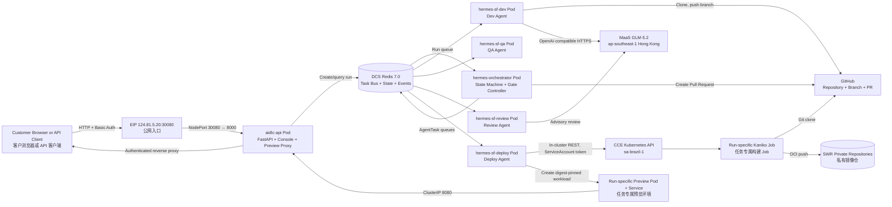
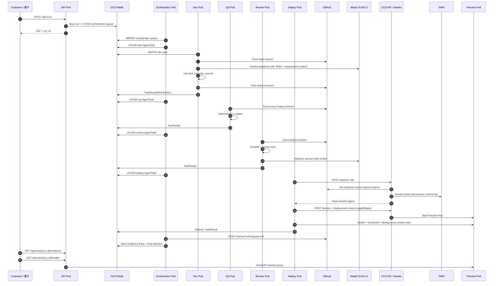
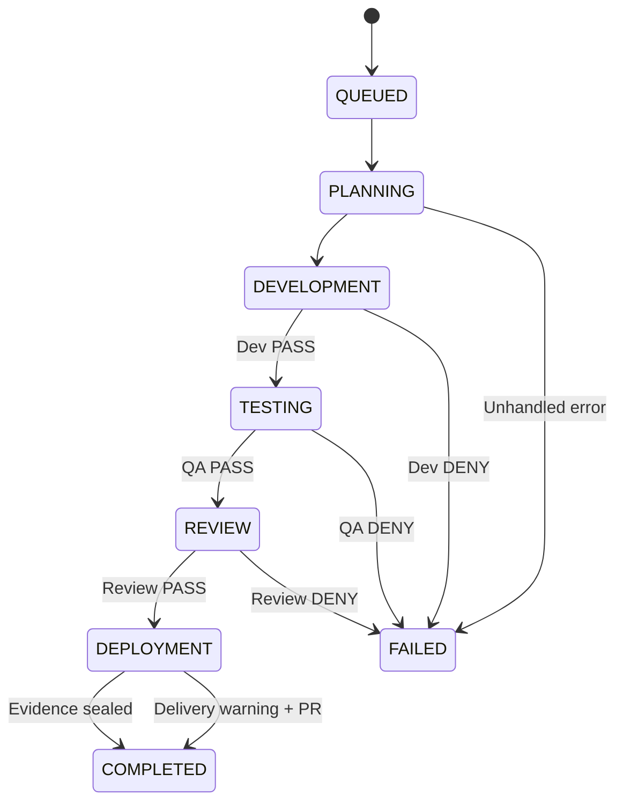
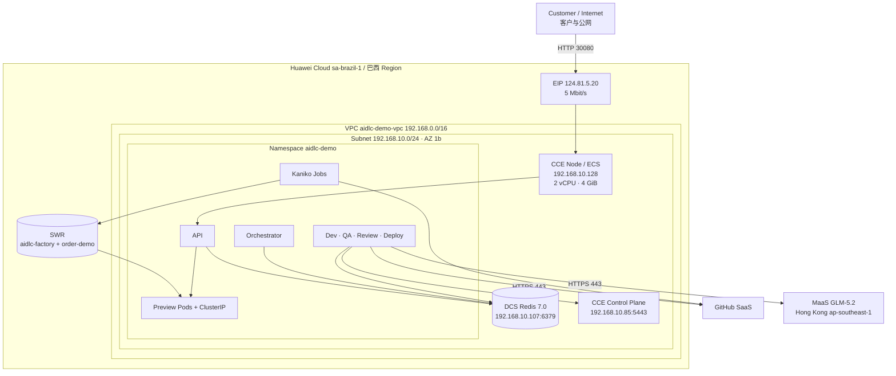

# AI-DLC Demo Detailed Design / AI-DLC Demo 详细设计

**Document version / 文档版本:** 1.0  
**As-built snapshot / 实际部署快照:** 2026-09-20, Huawei Cloud Brazil and Hong Kong  
**Implementation baseline / 实现基线:** Platform image `aidlc-factory:3.0.0` with runtime/web patch annotation `4.0.0`

This document describes the implementation that is actually running, not only the target concept. It is based on the source code, Kubernetes manifests, Huawei Cloud resource APIs, the live CCE workload inventory, and completed run evidence.

本文描述当前真实运行的实现，而不只是目标概念。内容基于源码、Kubernetes 清单、华为云资源 API、在线 CCE 工作负载清单和已完成任务证据。

---

## 1. Purpose and scope / 目标与范围

The demo is a governed AI-DLC execution framework. A customer supplies a Git repository and OpenSpec-style requirement artifacts. Hermes coordinates specialized Pods for development, testing, review, delivery, and evidence. GLM-5.2 provides model reasoning, while deterministic gates decide whether execution may continue.

该 Demo 是一套带治理机制的 AI-DLC 执行框架。客户提供 Git 仓库和 OpenSpec 风格的需求产物；Hermes 编排开发、测试、评审、交付和证据 Pod；GLM-5.2 提供模型推理能力，而是否继续执行由确定性门禁决定。

### 1.1 Generic framework versus demo-specific code / 通用框架与 Demo 专用代码的边界

| Area / 范围 | Generic framework capability / 通用框架能力 | Current order-demo specialization / 当前订单 Demo 专用部分 |
|---|---|---|
| Orchestration / 编排 | Run state, queues, stage graph, Skill loading, gates, evidence / 任务状态、队列、阶段图、Skill 加载、门禁、证据 | Fixed sequential graph: Dev → QA → Review → Deploy / 固定串行任务图 |
| Repository integration / 代码仓集成 | Clone, feature branch, commit, push, Pull Request / 克隆、功能分支、提交、推送、PR | Expects Python source at `src/order_service.py` / 预期固定 Python 源码路径 |
| Requirement integration / 需求集成 | Reads requirement, spec, design, tasks, tests / 读取需求、规格、设计、任务、测试 | Default files: `demo/GITHUB_ISSUE.md`, `sdd/*.md|yaml` / 默认文件位置 |
| Development / 开发 | Skill-guided model call plus deterministic retest / Skill 引导模型调用并确定性重测 | Model returns one complete Python file; fallback is an order-cancellation implementation / 模型返回一个完整 Python 文件，Fallback 为取消订单实现 |
| QA and review / 测试与评审 | Independent clone and repeatable gates / 独立克隆与可重复门禁 | Uses Python `unittest`, `compileall`, and three secret regex patterns / 使用固定 Python 工具和三类秘钥正则 |
| Delivery / 交付 | Kaniko build, SWR digest, CCE Preview, smoke evidence / Kaniko 构建、SWR 摘要、CCE Preview、冒烟证据 | Smoke test calls `/health` and `POST /orders/ORDER-1001/cancel` / 冒烟测试使用订单接口 |
| Customer extension / 客户扩展 | Replace Skills, task graph, repository adapter, test adapter, review policy, and smoke-test contract / 可替换 Skills、任务图、仓库适配器、测试适配器、评审策略和冒烟契约 | These extension points are code/configuration changes in the current version, not self-service UI settings / 当前版本需要改代码或配置，并非 UI 自助配置 |

The framework shell is reusable, but the current Worker implementation is intentionally small and Python/order-service specific. This distinction should be stated clearly during a customer demonstration.

框架外壳可以复用，但当前 Worker 实现为了 Demo 简洁，仍然绑定 Python/订单服务。客户演示时应明确说明这一边界。

---

## 2. Logical architecture / 逻辑架构



### 2.1 Component responsibilities / 组件职责

| Component / 组件 | Responsibility / 职责 | Directly callable interface / 可直接调用接口 |
|---|---|---|
| `aidlc-api` | Customer API, Console static files, Basic Auth, dashboard aggregation, Preview proxy / 客户 API、Console 静态页面、Basic Auth、统计聚合、Preview 代理 | HTTP on container port 8000; exposed by NodePort 30080 / 容器 8000，NodePort 30080 |
| `hermes-orchestrator` | Build task graph, dispatch Workers, evaluate gates, create PR, seal evidence / 生成任务图、分派 Worker、评估门禁、创建 PR、封存证据 | Redis queue only; no HTTP Service / 仅 Redis 队列，无 HTTP Service |
| `hermes-sf-dev` | Read requirement artifacts, call GLM-5.2, modify/test/commit/push code / 读取需求产物、调用模型、修改/测试/提交/推送代码 | Redis task/result protocol; outbound Git and MaaS / Redis 任务与结果协议；出站 Git、MaaS |
| `hermes-sf-qa` | Independently rerun deterministic tests / 独立重跑确定性测试 | Redis task/result protocol / Redis 任务与结果协议 |
| `hermes-sf-review` | Compile, secret scan, model-assisted review / 编译、秘钥扫描、模型辅助评审 | Redis task/result protocol; outbound MaaS / Redis 协议；出站 MaaS |
| `hermes-sf-deploy` | Create Kaniko Job, push SWR, deploy CCE Preview, run smoke tests / 创建 Kaniko Job、推送 SWR、部署 Preview、执行冒烟测试 | Redis protocol plus in-cluster Kubernetes REST API / Redis 协议及集群内 Kubernetes REST API |
| DCS Redis | Run state, queues, results, events, evidence / 任务状态、队列、结果、事件、证据 | Redis TCP 6379 inside VPC / VPC 内 Redis TCP 6379 |
| SWR | Platform runtime image and generated application images / 平台运行镜像和生成的应用镜像 | OCI registry HTTPS / OCI 镜像仓 HTTPS |
| CCE Preview | Run-specific live application / 每个任务专属的真实应用环境 | ClusterIP 8080; exposed only through authenticated API proxy / ClusterIP 8080，仅通过鉴权代理访问 |

---

## 3. End-to-end execution sequence / 端到端执行时序



The control plane is asynchronous. `POST /api/runs` does not wait for completion; the Console polls run state. Each stage starts only after the preceding Worker returns a result and the Orchestrator evaluates its gate.

控制面采用异步模式。`POST /api/runs` 不等待任务完成，Console 轮询任务状态。只有前一个 Worker 返回结果并由 Orchestrator 完成门禁判定后，下一阶段才会启动。

---

## 4. External HTTP API design / 外部 HTTP API 设计

### 4.1 Authentication / 鉴权

- `GET /health` is unauthenticated for platform probes. / `GET /health` 不鉴权，供平台健康检查使用。
- All other paths use HTTP Basic Authentication through FastAPI middleware. / 其余路径均通过 FastAPI 中间件执行 HTTP Basic Authentication。
- Username and password come from `AIDLC_DEMO_USERNAME` and `AIDLC_DEMO_PASSWORD` in Kubernetes Secret `aidlc-secrets`. / 用户名和密码来自 Kubernetes Secret `aidlc-secrets`。
- Comparison uses `secrets.compare_digest`. / 凭证比较使用 `secrets.compare_digest`。
- TLS is not terminated by the current Demo NodePort. Production should place HTTPS ingress or a gateway in front. / 当前 Demo NodePort 未终止 TLS；生产环境应增加 HTTPS Ingress 或网关。

### 4.2 Endpoint catalog / 接口清单

| Method and path / 方法与路径 | Purpose / 用途 | Main response / 主要响应 | Errors / 错误 |
|---|---|---|---|
| `GET /` | Return Console `index.html` / 返回 Console 页面 | HTML | 401 if authentication fails / 鉴权失败返回 401 |
| `GET /static/*` | CSS and JavaScript / 静态资源 | Static file / 静态文件 | 401, 404 |
| `GET /health` | API and Redis health / API 与 Redis 健康状态 | `status`, service, Redis flag, model and regions / 状态、服务、Redis、模型和区域 | Always HTTP 200; body can be `degraded` / 始终 HTTP 200，Body 可为 degraded |
| `GET /api/architecture` | Logical component and Skill registry / 逻辑组件与 Skill 注册表 | Architecture JSON / 架构 JSON | 401 |
| `POST /api/runs` | Create an asynchronous AI-DLC run / 创建异步任务 | HTTP 202, `run_id`, `QUEUED`, status URL / 任务 ID、队列状态、查询地址 | 401, 422 |
| `GET /api/runs` | List recent runs / 查询近期任务 | `{"runs":[...]}` | 401 |
| `GET /api/dashboard` | Aggregate history, success, duration and tokens / 聚合历史、成功率、耗时、Token | `summary` plus run rows / 汇总及任务列表 | 401 |
| `GET /api/runs/{run_id}` | Full state, Worker results and events / 完整状态、Worker 结果和事件 | Run state JSON / 任务状态 JSON | 401, 404 |
| `GET /api/runs/{run_id}/events` | Timestamped execution timeline / 带时间戳的执行时间线 | Ordered event array / 有序事件数组 | 401, 404 |
| `GET /api/runs/{run_id}/evidence` | Sealed Evidence Pack / 已封存证据包 | Evidence schema 3.0 / 证据结构 3.0 | 401, 404 if not ready / 未就绪返回 404 |
| `GET|POST /preview/{run_id}/{path}` | Authenticated proxy to that run's Preview Service / 代理到任务专属 Preview Service | Upstream status/body/content type / 上游状态、内容和类型 | 401, 404, 502 |

### 4.3 Create-run request / 创建任务请求

The implemented request schema is:

实际实现的请求结构为：

```json
{
  "repository": "https://github.com/seancjxu-ship-it/AIDLC_Simple_Order_Demo",
  "base_branch": "main",
  "requirement_file": "demo/GITHUB_ISSUE.md",
  "execution_mode": "live",
  "skill_profile": "openspec-core+aidlc-demo",
  "model": "glm-5.2"
}
```

| Field / 字段 | Type / 类型 | Validation and behavior / 校验与行为 |
|---|---|---|
| `repository` | string | Git URL; currently passed to `git clone` / Git 地址，传给 `git clone` |
| `base_branch` | string | Pattern `^[A-Za-z0-9._/-]+$`; default `main` / 正则校验，默认 main |
| `requirement_file` | string | Repository-relative path; default `demo/GITHUB_ISSUE.md` / 仓库相对路径 |
| `execution_mode` | `plan|live` | Console always submits `live`; only live performs push/build/deploy/PR / Console 固定提交 live |
| `skill_profile` | string | Recorded in request; stage Skills currently come from static mapping / 记录在请求中，当前阶段 Skill 仍由静态映射决定 |
| `model` | string | Recorded in request; runtime client uses configured `MAAS_MODEL` / 记录在请求中，实际客户端使用配置的 MAAS_MODEL |

> **Current support boundary / 当前支持边界:** The schema accepts `plan`, but the customer demonstration and acceptance path validated here is `live`. Treat `plan` as a reserved mode in this build. / 数据结构允许 `plan`，但当前已验证的客户演示与验收路径是 `live`；本版本应把 `plan` 视为预留模式。

A free-form requirement body is not accepted by the current API. The requirement must exist inside the repository at `requirement_file`. Supporting inline requirements requires extending `RunRequest` and the Dev prompt builder.

当前 API 不接收自由文本需求正文；需求必须位于仓库的 `requirement_file` 路径。若需要支持 API 直接传入需求正文，应扩展 `RunRequest` 和 Dev Prompt 构造逻辑。

### 4.4 Create-run response / 创建任务响应

```json
{
  "run_id": "run-6a843f1a841a",
  "status": "QUEUED",
  "status_url": "/api/runs/run-6a843f1a841a"
}
```

Clients should poll the status URL until `COMPLETED` or `FAILED`. / 客户端应轮询状态接口，直到 `COMPLETED` 或 `FAILED`。

### 4.5 Preview proxy behavior / Preview 代理行为

The proxy obtains `internal_url` from the successful Deploy result, forwards GET or POST, query parameters, request body, and `Content-Type`, and returns the upstream body/status/content type. It does not expose a Preview NodePort.

代理从成功的 Deploy 结果中读取 `internal_url`，转发 GET/POST、Query、Body 和 `Content-Type`，再返回上游状态和内容。Preview 本身不暴露 NodePort。

Current constraints / 当前限制：

- Timeout is 15 seconds. / 超时为 15 秒。
- Only GET and POST are registered. / 仅注册 GET 和 POST。
- Arbitrary customer headers are not forwarded. / 不转发任意客户 Header。
- Authorization is the Console Basic Auth, not per-run authorization. / 使用 Console 级 Basic Auth，不是任务级鉴权。

---

## 5. Internal task and event interfaces / 内部任务与事件接口

The Orchestrator and Workers do not call each other through HTTP. They use Redis lists and JSON messages.

Orchestrator 与 Worker 之间不使用 HTTP，而是使用 Redis List 和 JSON 消息。

### 5.1 Redis key contract / Redis Key 契约

| Key pattern / Key 模式 | Data structure / 结构 | Producer / 生产者 | Consumer / 消费者 | Retention / 保留 |
|---|---|---|---|---|
| `aidlc:run:{run_id}` | String JSON | API, Orchestrator / API、编排器 | API, Orchestrator / API、编排器 | No explicit TTL / 未设置 TTL |
| `aidlc:queue:orchestrator` | List | API | Orchestrator | Until consumed / 消费前保留 |
| `aidlc:queue:{dev|qa|review|deploy}` | List | Orchestrator | Corresponding Worker / 对应 Worker | Until consumed |
| `aidlc:result:{task_id}` | List | Worker | Orchestrator | 3,600 seconds / 3600 秒 |
| `aidlc:events:{run_id}` | List of JSON | All Pods / 全部 Pod | API/Console | 86,400 seconds / 86400 秒 |
| `aidlc:event-sequence:{run_id}` | Integer | All Pods via atomic `INCR` / 全部 Pod 原子递增 | Event writer | No explicit TTL in current code / 当前未设置 TTL |
| `aidlc:evidence:{run_id}` | String JSON | Orchestrator | API/Console | 86,400 seconds / 86400 秒 |

Queue semantics use `LPUSH` and blocking `BRPOP`, providing FIFO behavior for each role queue.

队列采用 `LPUSH` 与阻塞式 `BRPOP`，在每个角色队列内形成 FIFO 行为。

### 5.2 AgentTask schema / AgentTask 结构

```json
{
  "task_id": "run-...:dev:1234abcd",
  "run_id": "run-...",
  "role": "dev",
  "stage": "DEVELOPMENT",
  "skill_names": ["openspec-apply-change", "aidlc-python-development"],
  "payload": {
    "repository": "...",
    "base_branch": "main",
    "requirement_file": "demo/GITHUB_ISSUE.md",
    "execution_mode": "live",
    "branch": "aidlc/openspec-...",
    "commit": "...",
    "pushed": true
  }
}
```

The `payload` starts with request fields. After each stage, the Orchestrator merges that Worker's `outputs` into the shared payload for the next stage.

`payload` 初始包含请求字段；每个阶段结束后，Orchestrator 把该 Worker 的 `outputs` 合并到共享 Payload，传给下一阶段。

### 5.3 TaskResult schema / TaskResult 结构

```json
{
  "task_id": "run-...:qa:1234abcd",
  "run_id": "run-...",
  "role": "qa",
  "passed": true,
  "summary": "QA gate passed / QA 门禁通过",
  "outputs": {},
  "completed_at": "ISO-8601 UTC"
}
```

### 5.4 Event schema / 事件结构

Each event contains an atomic sequence number, timestamp, stage, actor, actual Pod hostname, bilingual detail, result, and optional metadata.

每条事件包含原子序号、时间戳、阶段、Actor、实际 Pod 主机名、双语说明、结果和可选 Metadata。

```json
{
  "sequence": 18,
  "at": "2026-09-20T03:02:00+00:00",
  "stage": "IMAGE_BUILD",
  "actor": "hermes-sf-deploy",
  "pod": "hermes-sf-deploy-...",
  "detail": "Kaniko build started ... / Kaniko 已开始构建",
  "result": "START",
  "metadata": {
    "task_id": "...",
    "job": "aidlc-build-run-...",
    "commit": "..."
  }
}
```

### 5.5 Pod-to-Pod communication model / Pod 间通信模型

The AIDLC Pods do **not** expose a REST endpoint to each other. The customer-facing boundary uses REST/JSON, while internal Agent coordination uses DCS Redis lists carrying JSON-serialized `AgentTask` and `TaskResult` messages.

AIDLC 各 Pod 之间**不通过彼此暴露 REST 接口**进行调用。客户界面使用 REST/JSON；内部 Agent 协作通过 DCS Redis List 传递 JSON 序列化的 `AgentTask` 和 `TaskResult`。

```text
Customer Browser / API Client
              │ REST/JSON
              ▼
        aidlc-api Pod
              │ LPUSH aidlc:queue:orchestrator
              ▼
        DCS Redis Task Bus
              │ BRPOP
              ▼
    hermes-orchestrator Pod
              │
              ├─ LPUSH queue:dev     ─▶ hermes-sf-dev
              ├─ LPUSH queue:qa      ─▶ hermes-sf-qa
              ├─ LPUSH queue:review  ─▶ hermes-sf-review
              └─ LPUSH queue:deploy  ─▶ hermes-sf-deploy
                                           │
Each Worker ── LPUSH result:<task_id> ─────┘
Orchestrator ─ BRPOP result:<task_id> and evaluates the gate
```

There is no direct `Dev -> QA -> Review -> Deploy` HTTP chain. A Worker returns its result to the Orchestrator; the Orchestrator merges the returned `outputs` into the shared payload and dispatches the next stage only after the current gate passes.

不存在直接的 `Dev -> QA -> Review -> Deploy` HTTP 调用链。Worker 把结果返回 Orchestrator；Orchestrator 将该阶段 `outputs` 合并进共享 Payload，只有当前门禁通过后才分派下一阶段。

### 5.6 Queue operations and execution sequence / 队列操作与执行时序

| Step / 步骤 | Producer / 生产者 | Redis operation / Redis 操作 | Consumer / 消费者 | Payload / 数据 |
|---:|---|---|---|---|
| 1 | API Pod | `LPUSH aidlc:queue:orchestrator <run_id>` | Orchestrator | Run identifier / 任务标识 |
| 2 | Orchestrator | `BRPOP aidlc:queue:orchestrator` | Orchestrator | Blocking wait for a new run / 阻塞等待新任务 |
| 3 | Orchestrator | `LPUSH aidlc:queue:{role} <AgentTask JSON>` | Role Worker | Repository, branch, stage, Skills and shared outputs / 仓库、分支、阶段、Skills 与共享输出 |
| 4 | Worker | `BRPOP aidlc:queue:{role}` | Dev, QA, Review or Deploy | One role-specific task / 对应角色任务 |
| 5 | Worker | `LPUSH aidlc:result:{task_id} <TaskResult JSON>` | Orchestrator | `passed`, summary and outputs / 门禁结果、摘要与输出 |
| 6 | Orchestrator | `BRPOP aidlc:result:{task_id}` | Orchestrator | Blocking wait, default timeout 600 seconds / 阻塞等待，默认超时 600 秒 |
| 7 | All runtime Pods | `RPUSH aidlc:events:{run_id} <Event JSON>` | API/Console | Timestamp, Pod hostname, stage, result and metadata / 时间戳、Pod、阶段、结果与元数据 |

`LPUSH` plus blocking `BRPOP` provides FIFO processing for each queue. The Orchestrator and Workers are long-running consumers: an idle Pod blocks on Redis and does not call MaaS or consume model tokens until a task is received.

`LPUSH` 与阻塞式 `BRPOP` 为每个队列提供 FIFO 处理。Orchestrator 和 Worker 是长期运行的消费者；空闲 Pod 阻塞等待 Redis，不会调用 MaaS，也不会产生模型 Token 消耗。

Current Demo queue and state storage uses Huawei Cloud DCS Redis at `192.168.10.107:6379` inside the Brazil VPC.

当前 Demo 的队列与状态存储使用巴西 VPC 内的华为云 DCS Redis：`192.168.10.107:6379`。

### 5.7 Protocol boundary matrix / 通信协议矩阵

| Source / 源 | Destination / 目标 | Protocol / 协议 | Purpose / 用途 |
|---|---|---|---|
| Customer browser or customer system / 客户浏览器或客户系统 | `aidlc-api` | HTTP REST + JSON; Basic Auth except `/health` / HTTP REST + JSON；除健康检查外使用 Basic Auth | Start runs, query state/events/evidence, open Console / 创建任务、查询状态/事件/证据、访问 Console |
| `aidlc-api` | Orchestrator | Redis List + JSON | Submit `run_id`; no direct Pod HTTP call / 提交 run_id，不直接调用 Orchestrator HTTP 接口 |
| Orchestrator | Dev, QA, Review, Deploy | Redis List + `AgentTask` JSON | Role-based asynchronous dispatch / 按角色异步分派任务 |
| Dev, QA, Review, Deploy | Orchestrator | Redis List + `TaskResult` JSON | Return gate result and stage outputs / 返回门禁结果与阶段输出 |
| All AIDLC Pods | DCS Redis | Redis protocol over TCP 6379 | Run state, queues, results, events and evidence / 状态、队列、结果、事件与证据 |
| API Pod | Preview Service | Cluster-internal HTTP through `*.svc.cluster.local:8080` | Authenticated reverse proxy for `/preview/{run_id}/{path}` / Preview 鉴权反向代理 |
| Deploy Worker | Preview Service | Cluster-internal HTTP | Health, order and replay smoke tests / 健康检查、订单与重放冒烟测试 |
| Deploy Worker | CCE Kubernetes API | HTTPS Kubernetes REST API | Create/watch Kaniko Jobs, Preview Deployments, Pods and Services / 创建和观察构建与预览资源 |
| Dev and Review Workers | Hong Kong ModelArts MaaS GLM-5.2 | HTTPS, OpenAI-compatible JSON API | Code generation and model-assisted review / 代码生成与模型辅助评审 |
| Dev/Orchestrator | GitHub | HTTPS Git and GitHub REST API | Clone, push branch and create Pull Request / 克隆、推送分支与创建 PR |
| Kaniko Job Pod | Huawei Cloud SWR | OCI Registry API over HTTPS | Push immutable application image / 推送不可变业务镜像 |

The internal Redis bus was selected instead of synchronous Agent-to-Agent REST calls because AIDLC stages can run for minutes. Queue-based decoupling allows independent Pod restart and scaling, blocking waits with explicit timeouts, centralized state/evidence, and a complete timestamped audit trail.

内部采用 Redis 总线而不是同步的 Agent 间 REST，是因为 AIDLC 阶段可能持续数分钟。队列解耦支持 Pod 独立重启与扩缩容、带明确超时的阻塞等待、集中式状态/证据管理，以及完整的时间戳审计轨迹。

The external REST API remains stable even if the internal transport is later replaced by Kafka, RabbitMQ, Huawei Cloud Distributed Message Service, or Kubernetes Jobs.

即使未来把内部传输替换为 Kafka、RabbitMQ、华为云分布式消息服务或 Kubernetes Job，面向客户的 REST API 仍可保持稳定。

---

## 6. Orchestrator Pod detailed design / Orchestrator Pod 详细设计

### 6.1 Process model / 进程模型

Container command: `entrypoint.sh orchestrator` → `python -m aidlc.orchestrator_main` → infinite `run_orchestrator()` loop.

容器启动命令依次进入 `entrypoint.sh orchestrator`、`aidlc.orchestrator_main`，然后执行无限任务循环。

The Pod blocks on `aidlc:queue:orchestrator`. It does not expose a port and has no Kubernetes Service.

Pod 阻塞等待 `aidlc:queue:orchestrator`，不监听业务端口，也没有 Kubernetes Service。

### 6.2 Static task graph / 固定任务图

```text
DEVELOPMENT(dev)
  -> TESTING(qa)
  -> REVIEW(review)
  -> DEPLOYMENT(deploy)
  -> PULL_REQUEST
  -> EVIDENCE
```

| Stage / 阶段 | Worker / Worker | Skills / Skills |
|---|---|---|
| DEVELOPMENT | `hermes-sf-dev` | `openspec-apply-change`, `aidlc-python-development` |
| TESTING | `hermes-sf-qa` | `aidlc-test-execution` |
| REVIEW | `hermes-sf-review` | `aidlc-code-review`, `aidlc-security-review` |
| DEPLOYMENT | `hermes-sf-deploy` | `aidlc-swr-delivery` |

Requirement and planning events reference OpenSpec context, while execution Skills are passed in each `AgentTask`.

需求与规划事件引用 OpenSpec 上下文，执行阶段 Skills 则通过每个 `AgentTask` 传递。

### 6.3 Orchestration algorithm / 编排算法

1. Read run state from Redis. / 从 Redis 读取任务状态。
2. Set status to `PLANNING`; emit requirement and plan events. / 更新为 PLANNING，并产生需求/规划事件。
3. For each pipeline stage, create a unique `task_id`. / 为每个阶段生成唯一 task_id。
4. Update current Agent and task in run state. / 更新当前 Agent 和任务。
5. Push `AgentTask` to the role queue. / 将任务推送到角色队列。
6. Block for `TaskResult`, default timeout 600 seconds. / 阻塞等待结果，默认超时 600 秒。
7. Merge outputs into shared payload and evaluate `passed`. / 合并输出并判断 passed。
8. A failed Dev, QA, or Review gate immediately sets `FAILED/DENY`. / Dev、QA、Review 失败立即终止为 FAILED/DENY。
9. A Deploy failure may still allow a PR with a delivery warning. / Deploy 失败仍可允许创建带交付告警的 PR。
10. In live mode, if the feature branch was pushed, call GitHub Pull Request API. / live 模式且已推送分支时创建 PR。
11. Seal Evidence Pack and calculate final decision. / 封存证据包并计算最终决策。

### 6.4 Final-decision matrix / 最终决策矩阵

| Condition / 条件 | Decision / 决策 |
|---|---|
| PR created + real delivery passed / PR 已创建且真实交付通过 | `ALLOW_PR_AND_PREVIEW` |
| PR created + delivery failed / PR 已创建但交付失败 | `ALLOW_PR_WITH_DELIVERY_WARNING` |
| PR created, no real preview / 已创建 PR，无真实 Preview | `ALLOW_PR` |
| No PR + delivery passed / 无 PR，交付通过 | `ALLOW_PREVIEW` |
| Dev/QA/Review failure or unhandled error / 前置门禁或未处理异常 | `DENY` |

### 6.5 Callable interfaces / 可调用接口

The Orchestrator has no direct customer API. Its callable contract is:

Orchestrator 没有客户直连接口，其可调用契约为：

- Input: Redis list `aidlc:queue:orchestrator`, value is `run_id`. / 输入为 run_id 队列。
- Output: run-state updates, Worker tasks, events, Evidence Pack, optional GitHub PR. / 输出为状态、Worker 任务、事件、证据包和可选 PR。
- External API: `POST https://api.github.com/repos/{owner}/{repo}/pulls`. / 外部 API 为 GitHub 创建 PR 接口。

---

## 7. Dev Agent Pod detailed design / Dev Agent Pod 详细设计

### 7.1 Input contract / 输入契约

Required input includes repository, base branch, requirement file, execution mode, and selected Skills. The source repository is expected to contain:

必需输入包括仓库、基线分支、需求文件、执行模式和选定 Skills。当前期望仓库包含：

- `src/order_service.py`
- `tests/test_order_service.py`
- `demo/GITHUB_ISSUE.md`
- `sdd/spec.md`
- `sdd/design.md`
- `sdd/tasks.yaml`

### 7.2 Execution details / 执行细节

1. Create an isolated workspace under `/tmp/aidlc-runs/{run_id}/dev-{task_id}`. / 创建隔离工作目录。
2. Shallow-clone the base branch with `git clone --depth 1 --branch`. / 浅克隆基线分支。
3. Run the initial deterministic gate: `python -m unittest discover -s tests -v`. / 执行首轮确定性测试。
4. Create branch `aidlc/openspec-{run_suffix}`. / 创建功能分支。
5. Load the complete content of the selected Skill files. / 加载选定 Skill 文件全文。
6. Build a model prompt from requirement, spec, design, tasks, current source, tests, and first gate output. / 使用需求、规格、设计、任务、源码、测试和首轮结果构造 Prompt。
7. Call GLM-5.2 through the OpenAI-compatible MaaS endpoint. / 通过 OpenAI 兼容 MaaS 接口调用 GLM-5.2。
8. Require model output to be a complete parseable Python file; strip Markdown fences and validate with `ast.parse`. / 要求返回完整可解析 Python 文件。
9. If the model call or parse fails and fallback is enabled, write the deterministic built-in implementation. / 模型或解析失败且允许 Fallback 时写入内置实现。
10. Run the test gate again. If it fails after a model change, optionally retry with fallback. / 再次执行测试，必要时使用 Fallback 重试。
11. For this Demo only, add minimal `Dockerfile` and `app.py` if they do not exist. / 仅 Demo：缺失时加入最小容器文件。
12. Compile `src`, `tests`, and generated entry files with `compileall`. / 执行编译门禁。
13. Configure a non-human Git author, commit changed files, and push the branch in live mode. / 配置 Agent Git 作者、提交变更，并在 live 模式推送。

### 7.3 MaaS callable interface / MaaS 可调用接口

- Endpoint: `POST https://api-ap-southeast-1.modelarts-maas.com/openai/v1/chat/completions`
- Authorization: `Bearer ${MAAS_API_KEY}`
- Model: `glm-5.2`
- Temperature: `0.1`
- Timeout: 180 seconds / 180 秒
- Returned evidence: model name, request ID, prompt/completion/total token usage; model content is excluded from the summarized model metadata but the updated source is stored separately. / 证据包含模型、请求 ID 和 Token；模型 Content 不放入模型元数据，但更新后源码单独保存。

### 7.4 Git callable interface / Git 可调用接口

- `git clone --depth 1 --branch <base>`
- `git checkout -b <feature>`
- `git add ...`
- `git commit -m "fix: implement approved OpenSpec change"`
- `git rev-parse HEAD`
- `git push --set-upstream origin <feature>`

Authentication uses `GIT_ASKPASS=/app/scripts/git-askpass.sh` and `GITHUB_TOKEN`; interactive prompts are disabled.

认证通过 `GIT_ASKPASS` 与 `GITHUB_TOKEN` 完成，并禁用交互式输入。

### 7.5 Output and gate / 输出与门禁

| Output / 输出 | Meaning / 含义 |
|---|---|
| `branch`, `commit`, `pushed` | Traceable Git provenance / 可追溯 Git 来源 |
| `round1`, `round2` | Commands, exit codes, stdout/stderr, pass flag / 命令、退出码、日志、通过标志 |
| `fallback_used` | Whether the built-in deterministic source was used / 是否使用内置 Fallback |
| `changed_files` | Files included in commit / 提交文件 |
| `container_scaffold_added` | Dockerfile/app.py added by Demo / Demo 自动加入的容器文件 |
| `model` | Usage, request ID, model, optional error / Token、请求 ID、模型、可选错误 |
| `updated_source` | Source passed to later stages when branch is not pushed / 未推送时传给后续阶段的源码 |

Pass condition: second unit-test gate and compile gate both pass, and the commit succeeds.

通过条件：第二轮单元测试、编译门禁和 Git 提交全部成功。

---

## 8. QA Agent Pod detailed design / QA Agent Pod 详细设计

### 8.1 Independence model / 独立性设计

QA uses a separate workspace and a fresh repository clone. If Dev pushed a branch, QA clones that branch. Otherwise it clones the base branch and writes `updated_source` into the expected source path.

QA 使用独立工作目录和全新仓库克隆。Dev 已推送时直接克隆功能分支；未推送时克隆基线分支并写入 `updated_source`。

This avoids trusting only the Dev Pod's workspace and test process.

这避免只信任 Dev Pod 自己的工作目录和测试进程。

### 8.2 Callable interface / 可调用接口

- Input queue: `aidlc:queue:qa`
- Test command: `python -m unittest discover -s tests -v`
- Output queue: `aidlc:result:{task_id}`
- No HTTP port or Kubernetes Service. / 无 HTTP 端口和 Service。

### 8.3 Gate / 门禁

The QA gate equals the command exit code. Output records the command, exit code, last 16,000 characters of stdout/stderr, and `passed`.

QA 门禁直接取决于命令退出码。输出记录命令、退出码、stdout/stderr 最后 16000 字符和 `passed`。

---

## 9. Review Agent Pod detailed design / Review Agent Pod 详细设计

### 9.1 Review steps / 评审步骤

1. Fresh-clone the feature branch or reconstruct source for non-pushed execution. / 全新克隆功能分支，或在未推送场景重建源码。
2. Run `python -m compileall -q src tests [app.py]`. / 执行编译检查。
3. Scan `src/order_service.py` for three patterns: GitHub classic token, AWS-style AKIA key, and simple hard-coded password assignment. / 扫描三类秘钥模式。
4. Load `aidlc-code-review` and `aidlc-security-review`. / 加载评审 Skills。
5. Send source to GLM-5.2 for a concise secure-code review. / 调用 GLM-5.2 进行简洁安全评审。
6. Remove model content from persisted metadata, retaining usage/request ID or error. / 持久化时移除模型正文，仅保留用量、请求 ID 或错误。

### 9.2 Gate semantics / 门禁语义

```text
PASS = compile_check.passed AND secret_hits is empty
```

The model review is advisory in the current implementation. A MaaS review failure is recorded but does not by itself deny the gate.

当前模型评审属于建议型。MaaS 评审失败会被记录，但不会单独导致门禁失败。

### 9.3 Callable interface / 可调用接口

- Input queue: `aidlc:queue:review`
- MaaS: `POST /openai/v1/chat/completions`
- Output result: compile evidence, matched secret patterns, model-review metadata
- No HTTP port or Kubernetes Service. / 无 HTTP 端口和 Service。

---

## 10. Deploy Agent Pod detailed design / Deploy Agent Pod 详细设计

### 10.1 Prerequisites / 前置条件

Live delivery requires:

真实交付要求：

- `execution_mode=live`
- configured `SWR_IMAGE_REPO`
- feature `branch`
- exact `commit`
- `pushed=true`
- repository Dockerfile, either customer-owned or Demo-generated
- Kubernetes Secret `swr-pull` with `.dockerconfigjson`

### 10.2 Kubernetes client / Kubernetes 客户端

The Deploy Worker uses an in-cluster REST client, not an external `kubectl` process. It reads:

Deploy Worker 使用集群内 REST 客户端，而不是外部 `kubectl` 进程。它读取：

- ServiceAccount token: `/var/run/secrets/kubernetes.io/serviceaccount/token`
- Cluster CA: `/var/run/secrets/kubernetes.io/serviceaccount/ca.crt`
- API host/port: `KUBERNETES_SERVICE_HOST`, `KUBERNETES_SERVICE_PORT_HTTPS`

Used Kubernetes API paths / 使用的 Kubernetes API 路径：

| Method / 方法 | Path / 路径 | Purpose / 用途 |
|---|---|---|
| POST | `/apis/batch/v1/namespaces/aidlc-demo/jobs` | Create Kaniko build Job / 创建构建 Job |
| GET | `/apis/batch/v1/namespaces/aidlc-demo/jobs/{name}` | Poll Job status / 轮询 Job |
| GET | `/api/v1/namespaces/aidlc-demo/pods?labelSelector=...` | Find Job/Preview Pod / 查找 Pod |
| GET | `/api/v1/namespaces/aidlc-demo/pods/{pod}/log` | Read Kaniko logs / 读取构建日志 |
| POST | `/api/v1/namespaces/aidlc-demo/services` | Create Preview Service / 创建 Preview Service |
| POST | `/apis/apps/v1/namespaces/aidlc-demo/deployments` | Create Preview Deployment / 创建 Preview Deployment |
| GET | `/apis/apps/v1/namespaces/aidlc-demo/deployments/{name}` | Poll rollout / 轮询发布 |

HTTP errors include the last 2,000 characters of the Kubernetes response in the Worker exception; the Worker wrapper turns exceptions into a failed `TaskResult`.

Kubernetes HTTP 错误会把响应末尾 2000 字符写入异常；Worker 外层把异常转换为失败的 `TaskResult`。

### 10.3 Kaniko Job design / Kaniko Job 设计

Name: `aidlc-build-{run_id suffix}`, maximum 63 characters. / 名称最长 63 字符。

The Job has two stages sharing an `emptyDir` at `/workspace`:

Job 使用两个阶段，并通过 `/workspace` 的 `emptyDir` 共享内容：

1. **Init container `git-checkout`**
   - Image: platform runtime `aidlc-factory:3.0.0`
   - Command: shallow clone the exact feature branch
   - GitHub token injected from `aidlc-secrets/GITHUB_TOKEN`
   - Requests: 25m CPU, 32Mi; limits: 250m CPU, 256Mi

2. **Container `kaniko`**
   - Image: `gcr.io/kaniko-project/executor:v1.23.2-debug`
   - Context: `/workspace`
   - Dockerfile: `/workspace/Dockerfile`
   - Destination: `order-demo:<first 12 chars of commit>`
   - Digest output: `/dev/termination-log`
   - Registry config mounted from `swr-pull/.dockerconfigjson`
   - Requests: 100m CPU, 128Mi; limits: 1 CPU, 1Gi
   - Cache disabled; snapshot mode `redo`

Job policy / Job 策略：

- `backoffLimit: 0`
- `activeDeadlineSeconds: 900`
- `ttlSecondsAfterFinished: 3600`
- `restartPolicy: Never`

The Worker first reads the container termination message for a digest, then falls back to extracting the final `sha256:<64 hex>` value from logs. Missing or malformed digest fails delivery.

Worker 优先从容器终止消息读取摘要，必要时从日志提取最终 SHA-256；缺少或格式错误都会使交付失败。

### 10.4 SWR publication / SWR 发布

```text
Mutable lookup tag / 可读标签:
swr.sa-brazil-1.myhuaweicloud.com/aidlc-demo/order-demo:<commit[0:12]>

Runtime image / 实际部署引用:
swr.sa-brazil-1.myhuaweicloud.com/aidlc-demo/order-demo@sha256:<digest>
```

The commit tag is useful for humans; CCE deployment is pinned to the registry digest, so a later tag mutation cannot change an existing Preview.

Commit 标签便于人工识别；CCE 按镜像摘要固定部署，因此后续标签变化不会改变已有 Preview。

### 10.5 Preview Deployment and Service / Preview 工作负载

- One replica, run-specific name `order-preview-{run_id suffix}`. / 每任务一个副本和专属名称。
- Private `ClusterIP` Service on port 8080. / 私有 ClusterIP Service，端口 8080。
- Environment: `PORT`, `AIDLC_RUN_ID`, `AIDLC_COMMIT_SHA`. / 注入端口、任务 ID、提交 SHA。
- Readiness: GET `/health`, initial delay 2s, period 3s. / 就绪探针。
- Liveness: GET `/health`, initial delay 8s, period 10s. / 存活探针。
- Container must run as non-root. / 必须非 root 运行。
- Privilege escalation disabled; all Linux capabilities dropped. / 禁止提权并移除全部 Capability。
- Requests: 50m CPU, 64Mi; limits: 250m CPU, 256Mi. / 资源配额。
- Image pull uses `swr-pull`. / 使用 swr-pull 拉取镜像。

### 10.6 Smoke-test contract / 冒烟测试契约

1. Poll `GET /health` up to 25 times, two seconds apart. / 最多轮询 25 次，每次间隔 2 秒。
2. Require `status=ok`, exact `run_id`, and exact commit SHA. / 校验状态和来源。
3. Call `POST /orders/ORDER-1001/cancel` with a run-specific idempotency key. / 调用取消订单接口。
4. Require `status=CANCELLED`. / 要求取消成功。
5. Replay the same request and require an identical response. / 重放相同请求并要求响应完全一致。

### 10.7 Deploy output / Deploy 输出

Evidence contains:

证据包含：

- Git repository, branch, exact commit
- Kaniko Job, build Pod, duration and log tail
- SWR repository, tag, digest, immutable image reference
- CCE namespace, Deployment, Service, Pod, Pod IP, imageID and rollout duration
- Health response, functional response and idempotency result
- Console Preview path

---

## 11. Worker runtime wrapper / Worker 通用运行外层

All four role Deployments use the same platform image and entrypoint:

四个角色 Deployment 使用相同平台镜像和入口：

```text
entrypoint.sh worker <dev|qa|review|deploy>
  -> python -m aidlc.worker_main <role>
  -> run_worker(role)
```

The wrapper blocks on its role queue, emits START, invokes the role handler, converts any exception to a failed `TaskResult`, posts the result, emits PASS/DENY with duration, and continues waiting.

通用外层阻塞等待角色队列，写入 START 事件，调用角色处理器，把异常转成失败结果，回传结果，再写入带耗时的 PASS/DENY 事件并继续等待。

This means the Pods are long-running stateless consumers; durable workflow state is in DCS Redis and Git/SWR/CCE.

因此各 Pod 是长期运行的无状态消费者；持久化流程状态位于 DCS Redis、Git、SWR 和 CCE 中。

---

## 12. Run state and evidence / 任务状态与证据

### 12.1 State progression / 状态流转



### 12.2 Evidence Pack schema / 证据包结构

Evidence schema version `3.0` contains:

证据结构版本 `3.0` 包含：

- `run_id`, generation timestamp
- architecture snapshot
- original request
- selected Skills by stage
- Dev/QA/Review/Deploy results
- Pull Request information
- timestamped event list
- final decision

Console presents structured evidence cards and keeps raw JSON behind an expandable technical view.

Console 使用结构化证据卡展示，原始 JSON 放在可展开的技术视图中。

### 12.3 Dashboard aggregation / 统计聚合

The API aggregates up to 100 runs, calculating terminal success rate, average duration, total prompt/completion tokens, event count, PR link, and recent status.

API 最多聚合 100 个任务，计算终态成功率、平均耗时、Prompt/Completion Token、事件数量、PR 地址和近期状态。

Live snapshot on 2026-09-20 / 2026-09-20 在线快照：

- 9 completed runs, 0 failed, 100% recorded success rate. / 9 个已完成任务，0 个失败，记录成功率 100%。
- 67,820 total MaaS tokens. / MaaS 累计 67,820 Tokens。
- Latest run `run-6a843f1a841a`: `ALLOW_PR_AND_PREVIEW`, PR #9. / 最新任务已允许 PR 与 Preview。
- The success rate reflects Demo runs and is not a production SLO. / 该成功率仅反映 Demo，不是生产 SLO。

---

## 13. Huawei Cloud resource inventory / 华为云资源清单

### 13.1 Region placement / 区域放置

| Region / 区域 | Resources / 资源 | Reason / 原因 |
|---|---|---|
| `sa-brazil-1`, AZ `sa-brazil-1b` | VPC, subnet, CCE, ECS node, EIP, DCS Redis, SWR, all runtime Pods / 巴西运行资源 | Keep source execution, task state, images and Preview close to the Brazil customer / 研发执行、状态、镜像与预览靠近巴西客户 |
| `ap-southeast-1` Hong Kong / 香港 | ModelArts Studio MaaS GLM-5.2 API / GLM-5.2 模型 API | Required MaaS resource pool selected for this Demo / Demo 指定模型资源池 |
| External / 外部 | GitHub and upstream container registry / GitHub 与上游容器镜像仓 | Source control/PR and Kaniko/base images / 代码管理、PR、Kaniko 与基础镜像 |

### 13.2 Purchased or consumed cloud resources / 已购买或消费的云资源

| Service / 服务 | Actual resource / 实际资源 | Specification / 规格 | Purpose / 用途 |
|---|---|---|---|
| VPC | `aidlc-demo-vpc` | ID `887544c6-7390-4264-a617-fc9e3d2ec366`; CIDR `192.168.0.0/16`; status OK | Runtime network boundary / 运行网络边界 |
| Subnet | `aidlc-demo-subnet` | ID `6e39639d-c92a-4f1a-bdd2-0d4340d44a94`; `192.168.10.0/24`; gateway `192.168.10.1`; AZ 1b | CCE node and DCS private network / CCE 与 DCS 私网 |
| CCE | `aidlc-cce-demo` | ID `83ce4753-b311-11f1-9614-0255ac1000b6`; flavor `cce.s1.small`; Kubernetes 1.36; single control-plane AZ; RBAC | Container control plane / 容器控制面 |
| CCE network | Overlay L2 | Pod CIDR `172.16.0.0/16`; Service CIDR `10.247.0.0/16`; internal API `192.168.10.85:5443` | Pod and Service networking / Pod 与 Service 网络 |
| CCE node/ECS | `aidlc-workers-xcjec` | `s7n.large.2`; 2 vCPU, 4 GiB RAM; Huawei Cloud EulerOS 2.0; containerd/runc | Runs all platform, build and Preview Pods / 运行全部 Pod |
| EVS on node | Root + data disks / 系统盘与数据盘 | 40 GiB GPSSD root + 100 GiB GPSSD data | OS and container runtime data / 操作系统与容器数据 |
| EIP | `124.81.5.20` | ID `69be7770-6129-4e3f-b3f8-dbd224cd2b00`; 5 Mbit/s dedicated bandwidth; bound to `192.168.10.128` | Customer Console and SSH administration / Console 与 SSH 管理 |
| DCS Redis | `aidlc-dcs-redis` | ID `0cbf1554-d39e-4a53-810e-db0d32fc2f29`; Redis 7.0; single-node 128 MiB; `192.168.10.107:6379` | Queue, run state, event and evidence store / 队列、状态、事件、证据 |
| SWR namespace | `aidlc-demo` | Private repositories / 私有仓库 | Runtime and generated images / 平台与应用镜像 |
| SWR repository | `aidlc-factory` | Tag `3.0.0`; about 99 MB at snapshot time / 快照时约 99 MB | Shared platform runtime image / 平台运行镜像 |
| SWR repository | `order-demo` | Commit tags `9859851653da`, `7e04effc4fff`; two images; about 91 MB at snapshot time / 两个镜像 | Generated business Preview images / 生成的业务预览镜像 |
| MaaS | ModelArts Studio MaaS | Endpoint `api-ap-southeast-1.modelarts-maas.com/openai/v1`; model `glm-5.2` | Dev generation and Review assistance / Dev 生成和 Review 辅助 |
| Security groups | CCE-generated node/control-plane groups | Node SG `a60bb591-b9cf-47b2-8a7b-10e4a90f9bbb` | Node, NodePort, overlay and kubelet traffic / 节点与集群流量 |

Billing mode reported by the APIs is on-demand/pay-per-use for CCE, ECS node, and DCS in this Demo. No high availability, disaster recovery, or backup resources were purchased, per Demo scope.

API 显示该 Demo 的 CCE、ECS 节点和 DCS 为按需计费。根据 Demo 范围，没有购买高可用、容灾或备份资源。

### 13.3 Live Kubernetes inventory / 在线 Kubernetes 清单

Snapshot at 2026-09-20 / 2026-09-20 快照：

| Workload / 工作负载 | Replicas / 副本 | Image / 镜像 | Role / 作用 |
|---|---:|---|---|
| `aidlc-api` | 1 | `aidlc-factory:3.0.0` | Console, REST API, Preview proxy |
| `hermes-orchestrator` | 1 | `aidlc-factory:3.0.0` | Workflow controller / 流程控制器 |
| `hermes-sf-dev` | 1 | `aidlc-factory:3.0.0` | Dev Agent |
| `hermes-sf-qa` | 1 | `aidlc-factory:3.0.0` | QA Agent |
| `hermes-sf-review` | 1 | `aidlc-factory:3.0.0` | Review Agent |
| `hermes-sf-deploy` | 1 | `aidlc-factory:3.0.0` | Deploy Agent |
| `order-preview-run-216296b64c99` | 1 | `order-demo@sha256:593280...` | Verified Preview for PR #8 / PR #8 预览 |
| `order-preview-run-6a843f1a841a` | 1 | `order-demo@sha256:98783f...` | Latest verified Preview for PR #9 / PR #9 预览 |
| `aidlc-build-run-6a843f1a841a` | Completed Job | Kaniko 1.23.2 debug | Latest image build; duration 41 seconds / 最近构建，41 秒 |

Services / Service：

| Service / Service | Type / 类型 | Address / 地址 |
|---|---|---|
| `aidlc-api` | NodePort | ClusterIP `10.247.12.89:8000`; NodePort `30080` |
| `order-preview-run-216296b64c99` | ClusterIP | `10.247.23.90:8080` |
| `order-preview-run-6a843f1a841a` | ClusterIP | `10.247.215.180:8080` |

### 13.4 Base Pod resource policy / 基础 Pod 资源策略

| Pod type / Pod 类型 | Requests / 请求 | Limits / 上限 |
|---|---|---|
| API | 100m CPU, 128Mi | 500m CPU, 512Mi |
| Orchestrator | 100m CPU, 128Mi | 500m CPU, 512Mi |
| Each Worker / 每个 Worker | 100m CPU, 128Mi | 750m CPU, 768Mi |
| Each Preview / 每个 Preview | 50m CPU, 64Mi | 250m CPU, 256Mi |
| Kaniko build container | 100m CPU, 128Mi | 1 CPU, 1Gi |
| Git init container | 25m CPU, 32Mi | 250m CPU, 256Mi |

The single 2-vCPU/4-GiB node is intentionally small. Scheduling is based on requests, but concurrent builds and many retained Preview Pods can create resource pressure. The Demo currently runs builds serially through one Deploy Worker.

单节点规格有意保持较小。Kubernetes 按 Requests 调度，但并发构建或保留过多 Preview Pod 会造成压力；当前通过单个 Deploy Worker 串行构建。

---

## 14. Huawei Cloud deployment topology / 华为云部署拓扑



### 14.1 Network interaction matrix / 网络交互矩阵

| Source / 源 | Destination / 目标 | Protocol/port / 协议端口 | Purpose / 用途 |
|---|---|---|---|
| Customer browser | `124.81.5.20:30080` | HTTP/TCP | Console, API, Preview proxy / 控制台、API、预览代理 |
| API/Orchestrator/Workers | DCS `192.168.10.107:6379` | Redis/TCP | Queue and state / 队列与状态 |
| Dev/QA/Review/Kaniko init | GitHub | HTTPS 443 / Git protocol over HTTPS | Clone, push, PR / 克隆、推送、PR |
| Dev and Review | MaaS Hong Kong | HTTPS 443 | GLM-5.2 inference / 模型推理 |
| Deploy Worker | CCE API `192.168.10.85:5443` | HTTPS | Jobs, Pods, Services, Deployments / 管理运行资源 |
| Kaniko | SWR | HTTPS 443 | Push application image / 推送应用镜像 |
| CCE kubelet/containerd | SWR | HTTPS 443 | Pull platform and business images / 拉取镜像 |
| Kaniko | Docker Hub | HTTPS 443 | Pull Kaniko/base image dependencies when not cached / 拉取外部基础镜像 |
| API | Preview ClusterIP:8080 | HTTP inside cluster / 集群内 HTTP | Authenticated Preview reverse proxy / 鉴权预览代理 |
| CCE control plane | Node kubelet | TCP 10250 | CCE management / CCE 管理 |
| Pod overlay | Node/Pod network | UDP 4789 | Overlay L2 encapsulation / Overlay 网络 |

### 14.2 Public exposure / 公网暴露

The node security group contains an explicit `0.0.0.0/0 → TCP 30080` rule for the Demo Console. CCE also created NodePort-range rules and an SSH rule. This is acceptable only for a short-lived Demo.

节点安全组包含显式的 `0.0.0.0/0 → TCP 30080` Demo Console 规则，CCE 还创建了 NodePort 范围和 SSH 规则。该方式只适合短期 Demo。

Production recommendation / 生产建议：

- Replace public NodePort with ELB/Ingress/API Gateway and HTTPS. / 使用 ELB、Ingress 或 API Gateway 并启用 HTTPS。
- Restrict source CIDRs or use VPN/private access. / 限制源 CIDR 或使用 VPN/私网。
- Restrict SSH to administrator IPs or remove public SSH. / 限制或移除公网 SSH。
- Add WAF/rate limiting if Internet-facing. / 公网场景增加 WAF 与限流。

---

## 15. Kubernetes configuration, Secrets and RBAC / Kubernetes 配置、秘钥与权限

### 15.1 ConfigMaps / ConfigMap

| Name / 名称 | Purpose / 用途 |
|---|---|
| `aidlc-config` | Redis URL, GitHub repository/default branch, MaaS endpoint/model, GitHub-write flag, base SWR value / 运行配置 |
| `aidlc-runtime-patch` | Six Python runtime files mounted into API/Orchestrator/Workers / 挂载六个 Python 运行时文件 |
| `aidlc-web` | Console HTML, JavaScript and CSS mounted at `/app/web` / Console 页面与样式 |

The live Deploy Worker overrides `SWR_IMAGE_REPO` to the `order-demo` repository and sets Kaniko, namespace, pull-secret, port, and timeout variables directly in its Deployment.

线上 Deploy Worker 在 Deployment 中覆盖 `SWR_IMAGE_REPO=.../order-demo`，并直接设置 Kaniko、Namespace、拉取 Secret、端口和超时变量。

### 15.2 Secrets / Secret

Only names and types are listed; values are not read or documented.

这里只列名称和类型，不读取或记录值。

| Secret / Secret | Type / 类型 | Used for / 用途 |
|---|---|---|
| `aidlc-secrets` | `Opaque` | Demo username/password, GitHub token, MaaS API key / Console、GitHub、MaaS 凭证 |
| `swr-pull` | `kubernetes.io/dockerconfigjson` | Kaniko push and private image pull / Kaniko 推送与私有镜像拉取 |
| `default-secret` | `kubernetes.io/dockerconfigjson` | CCE-generated default SWR pull credential / CCE 默认拉取凭证 |

The SWR temporary credential can be refreshed using `scripts/refresh-swr-secret.ps1`; temporary local files are deleted by the script.

SWR 临时凭证可通过 `scripts/refresh-swr-secret.ps1` 刷新，脚本会删除本地临时文件。

### 15.3 Deploy Worker RBAC / Deploy Worker 权限

ServiceAccount: `aidlc-deploy-worker` in Namespace `aidlc-demo`.

ServiceAccount 位于 `aidlc-demo` Namespace。

Allowed namespaced permissions / 允许的 Namespace 内权限：

- Core: `pods`, `pods/log`, `services` — get/list/watch/create/delete
- Apps: `deployments` — get/list/watch/create/delete
- Batch: `jobs` — get/list/watch/create/delete

No ClusterRole or cluster-wide permission is granted.

未授予 ClusterRole 或集群级权限。

### 15.4 Credential exposure observation / 凭证暴露现状

The base Helm template injects the complete `aidlc-secrets` Secret into API, Orchestrator, and every Worker through `envFrom`. This is simple for the Demo but broader than least privilege.

基础 Helm 模板通过 `envFrom` 把完整 `aidlc-secrets` 注入 API、Orchestrator 和所有 Worker，适合简化 Demo，但权限范围大于最小权限原则。

Production should split Secrets by component: Console credential for API, GitHub write credential for Dev/Orchestrator/build init, and MaaS key only for Dev/Review.

生产环境应按组件拆分 Secret：API 使用 Console 凭证，Dev/Orchestrator/构建 Init 使用 GitHub 凭证，只有 Dev/Review 使用 MaaS Key。

---

## 16. How the Huawei Cloud resources were deployed / 华为云资源如何部署

### 16.1 Infrastructure sequence / 基础设施部署顺序

1. Create `aidlc-demo-vpc` and `aidlc-demo-subnet` in `sa-brazil-1b`. / 创建 VPC 与子网。
2. Create single-node DCS Redis in the same VPC/subnet. / 在同一私网创建单节点 DCS。
3. Create CCE cluster `aidlc-cce-demo` using Overlay L2 and RBAC. / 创建 CCE 集群。
4. Create node pool `aidlc-workers` and one `s7n.large.2` node with GPSSD disks. / 创建节点池和单节点。
5. Attach a 5-Mbit/s EIP to the node for Console access and administration. / 为节点绑定 EIP。
6. Create private SWR namespace/repositories `aidlc-factory` and `order-demo`. / 创建私有 SWR 仓库。
7. Configure the Hong Kong MaaS API key/model endpoint. / 配置香港 MaaS。
8. Build and push the platform runtime image `aidlc-factory:3.0.0`. / 构建并推送平台镜像。
9. Deploy Namespace, ConfigMap, Secret, six platform Deployments, NodePort Service, ServiceAccount, Role and RoleBinding. / 部署 Kubernetes 资源。
10. Apply current runtime and web ConfigMap patches, rolling the affected Deployments. / 应用当前运行时代码与页面补丁。

### 16.2 Base Helm deployment / 基础 Helm 部署

Chart path: `deploy/helm/aidlc-factory`.

Helm creates:

Helm 创建：

- Namespace `aidlc-demo`
- `aidlc-config` ConfigMap
- `aidlc-secrets` Secret
- API, Orchestrator and four Worker Deployments
- API NodePort Service `8000:30080`
- Deploy Worker ServiceAccount, Role and RoleBinding
- `swr-pull` reference for private image pulls

### 16.3 Current Demo hot-patch mechanism / 当前 Demo 热补丁机制

The live Pods run image tag `3.0.0`, while updated Python files are mounted from `aidlc-runtime-patch` using `subPath`; Console files are mounted from `aidlc-web`. Pod template annotations are `aidlc-runtime-version: 4.0.0` and `aidlc-web-version: 4.0.0`.

线上 Pod 使用 `3.0.0` 镜像，但更新后的 Python 文件通过 `aidlc-runtime-patch` 以 `subPath` 挂载；Console 文件来自 `aidlc-web`。Pod 模板注解版本为 4.0.0。

This mechanism was chosen to iterate quickly without a second platform-image build. For production, the recommended release unit is an immutable new image tag/digest plus a Helm Upgrade, not source-code ConfigMap mounts.

该方式用于快速迭代，避免再次构建平台镜像。生产环境建议发布不可变的新镜像标签/摘要，并通过 Helm Upgrade 升级，而不是挂载源代码 ConfigMap。

---

## 17. Security and governance controls / 安全与治理控制

Implemented controls / 已实现控制：

- Basic Auth at the API/Console boundary. / API/Console Basic Auth。
- Kubernetes Secrets for credentials; credentials are not stored in Git. / 使用 Kubernetes Secret。
- Feature-branch-only Agent writes; human approval before merging main. / Agent 只写功能分支，合并 main 需人工审批。
- Deterministic QA and compile gates. / 确定性测试和编译门禁。
- Basic secret-pattern scan. / 基础秘钥模式扫描。
- Namespaced RBAC for Deploy Worker. / Deploy Worker Namespace 级 RBAC。
- Commit tag plus digest-pinned application deployment. / Commit 标签与摘要固定部署。
- Non-root Preview container, no privilege escalation, all capabilities dropped. / Preview 非 root、禁止提权。
- Run/commit provenance verified by the live health endpoint. / 健康接口校验任务与提交来源。
- Human-readable and raw evidence retained together. / 同时保留结构化与原始证据。

Demo-only risks / Demo 限制：

- HTTP rather than HTTPS at the public NodePort. / 公网入口使用 HTTP。
- DCS instance has no password and SSL is disabled; it is private-VPC only. / DCS 无密码且未启用 SSL，仅限私网。
- One CCE node and one Redis node; no HA, backup or DR by design. / 单节点，无高可用、备份或容灾。
- Broad NodePort and SSH security-group exposure. / NodePort 与 SSH 暴露范围较大。
- All components receive the shared Secret. / 组件共享 Secret。
- Evidence/events expire after one day, while run state has no TTL. / 事件/证据 1 天过期，任务状态无 TTL。
- Preview Deployments have no automatic cleanup controller. / Preview 尚无自动清理控制器。
- Kaniko pulls public upstream images, creating an external supply-chain dependency. / Kaniko 依赖公网基础镜像。

---

## 18. Failure behavior / 失败处理

| Failure / 失败 | Behavior / 行为 | Customer-visible evidence / 客户可见证据 |
|---|---|---|
| Redis unavailable at startup / Redis 不可用 | Pod waits up to 60 seconds, then exits; Deployment restarts it / 等待 60 秒后退出并由 Deployment 重启 | `/health` shows degraded for API / API 显示 degraded |
| Git clone/push failure / Git 失败 | Worker exception → failed TaskResult / Worker 返回失败 | Worker summary and event / 摘要与事件 |
| MaaS/parse failure in Dev / Dev 模型失败 | Use fallback when enabled; evidence records error and `fallback_used` / 允许 Fallback 时使用内置实现 | Dev evidence |
| Dev/QA/Review gate fails / 前置门禁失败 | Immediate `FAILED/DENY`; no later stage / 立即终止 | Run state and event |
| Review MaaS call fails / Review 模型失败 | Advisory error recorded; compile/secret rules still decide gate / 记录但不单独阻断 | `model_review.error` |
| Kaniko Job fails or times out / 构建失败或超时 | Deploy result fails / Deploy 失败 | Job logs tail and error event where available / 构建日志与错误事件 |
| No valid digest / 无有效摘要 | Delivery fails before deployment / 部署前失败 | Deploy summary |
| Preview rollout timeout / 发布超时 | Delivery fails / 交付失败 | Deployment status and Pod phases |
| Smoke test mismatch / 冒烟不一致 | Delivery fails / 交付失败 | Health/function/idempotency error |
| Deploy fails after review / Review 后交付失败 | PR can still be created with `ALLOW_PR_WITH_DELIVERY_WARNING` / 仍可创建带告警 PR | Final decision |
| Unhandled Orchestrator exception / 编排异常 | `FAILED/DENY` | Error type/message in run state |

---

## 19. Customer repository onboarding contract / 客户代码仓接入契约

### 19.1 Minimum input for this Demo / 本 Demo 最小输入

- Reachable GitHub repository / 可访问 GitHub 仓库
- Base branch / 基线分支
- Requirement file path / 需求文件路径
- `sdd/spec.md`, `sdd/design.md`, `sdd/tasks.yaml`
- Deterministic repository tests / 确定性仓库测试
- Expected Python source and test paths / 预期 Python 源码与测试路径
- GitHub token with repository Content and Pull Request read/write / GitHub Token 具备代码与 PR 读写权限

For this Demo, Dockerfile and `app.py` may be generated. In a customer production integration, the repository should own the Dockerfile, runtime port, health API, and smoke-test contract.

本 Demo 可自动生成 Dockerfile 与 `app.py`；客户生产接入时，应由代码仓维护 Dockerfile、运行端口、健康接口和冒烟测试契约。

### 19.2 Interfaces to generalize for other technology stacks / 面向其他技术栈的通用化接口

| Adapter / 适配点 | Current / 当前 | Target extension / 建议扩展 |
|---|---|---|
| Source adapter / 源码适配器 | One Python file / 单 Python 文件 | Patch set or repository-aware coding Agent / 多文件 Patch 或仓库感知 Agent |
| Test adapter / 测试适配器 | Python unittest | Configurable commands or pipeline definition / 可配置测试命令 |
| Build adapter / 构建适配器 | Root Dockerfile + Kaniko | Configurable Dockerfile/context/build args / 可配置构建上下文 |
| Review policy / 评审策略 | Compile + three regexes | SAST, dependency, license, policy-as-code / SAST、依赖、许可证、策略即代码 |
| Deployment adapter / 部署适配器 | One Deployment + Service | Helm/Kustomize/application template / Helm、Kustomize、应用模板 |
| Smoke adapter / 冒烟适配器 | Order cancellation | Repository-owned test specification / 仓库自带测试规范 |
| Workflow definition / 流程定义 | Static Python list | Declarative DAG/policy / 声明式 DAG 与策略 |
| Skill profile / Skill 配置 | Recorded but static mapping | Selectable customer Skill bundles / 可选择客户 Skill 包 |

---

## 20. Demonstration walkthrough for technical customers / 面向技术客户的演示顺序

1. Show the customer-owned inputs in GitHub: requirement, spec, design, tasks, tests, and source. / 展示客户输入。
2. Submit `POST /api/runs` from the Console. / 从 Console 发起任务。
3. Explain that API returns immediately and Redis decouples all Pods. / 说明异步和 Redis 解耦。
4. Follow timestamped events through actual Pod names. / 跟随带 Pod 名的时间线。
5. In Dev evidence, show failed initial tests, GLM token usage, changed files, commit and branch. / 展示 Dev 证据。
6. In QA/Review evidence, show independent test, compile and secret gates. / 展示独立门禁。
7. In Deploy evidence, show Kaniko Job, SWR tag/digest, CCE Pod imageID and smoke tests. / 展示真实交付证据。
8. Open the authenticated Preview and call `/health`. / 打开真实 Preview。
9. Open the GitHub Pull Request and emphasize human merge approval. / 打开 PR 并强调人工审批。
10. Finish with Dashboard statistics and token consumption. / 展示历史统计和 Token 消耗。

Recommended customer questions and answers / 建议客户问答：

- **Where is AI used? / AI 用在哪里？** Dev generation and Review assistance; workflow gates are deterministic. / 用于 Dev 生成和 Review 辅助，门禁是确定性的。
- **Is the image real? / 镜像真实吗？** Yes. Kaniko pushes to SWR and CCE runs the returned registry digest. / 是，真实推送 SWR 并按摘要运行。
- **Can an Agent merge main? / Agent 能合并 main 吗？** No. It creates a feature branch and PR; human approval remains required. / 不能，只创建分支和 PR。
- **How is a customer repository connected? / 如何对接客户仓？** Through the run API plus a GitHub token injected as a Secret; repository contracts define artifacts/tests/build. / 通过 API 与 Secret 中的 Token。
- **What is reusable? / 哪些可复用？** Orchestration, queues, Skills, evidence, Git/SWR/CCE lifecycle. Test/build/deploy adapters must be tailored to the customer's stack. / 编排、队列、Skills、证据和交付生命周期可复用，适配器需按技术栈调整。

---

## 21. Source-to-design traceability / 源码与设计对应

| Design area / 设计范围 | Source / 源码 |
|---|---|
| External API and Basic Auth / 外部 API 与鉴权 | `aidlc/api.py` |
| Request/task/result models / 数据模型 | `aidlc/models.py` |
| Redis bus and retention / Redis 总线与保留策略 | `aidlc/bus.py` |
| Task graph and decisions / 任务图与决策 | `aidlc/orchestrator.py` |
| Dev/QA/Review/Deploy implementation / 各 Agent 实现 | `aidlc/workers.py` |
| Kubernetes REST client and manifests / K8s 客户端与清单 | `aidlc/kubernetes.py` |
| Git clone/push/PR / Git 与 PR | `aidlc/gitops.py` |
| GLM-5.2 client / GLM 客户端 | `aidlc/maas.py` |
| Skill discovery and mapping / Skill 发现与映射 | `aidlc/skills.py`, `.hermes/skills/*/SKILL.md` |
| Runtime settings / 运行设置 | `aidlc/settings.py` |
| Container role entrypoint / 容器角色入口 | `scripts/entrypoint.sh` |
| Base image / 基础镜像 | `Dockerfile` |
| Helm deployment / Helm 部署 | `deploy/helm/aidlc-factory/*` |
| Live code/web patch / 在线代码与页面补丁 | `deploy/kubernetes/*-runtime-configmap-patch.yaml`, `api-web-configmap-patch.yaml` |
| Console / Console | `web/index.html`, `web/app.js`, `web/*.css` |
| Skill catalog / Skill 总表 | `docs/SKILLS_CATALOG_CN_EN.md` |

---

## 22. Non-goals of this Demo / 本 Demo 非目标

The following are deliberately outside scope:

以下内容有意不在本 Demo 范围内：

- High availability, backup, disaster recovery and multi-region failover / 高可用、备份、容灾、多 Region
- Enterprise SSO, tenant isolation and fine-grained user authorization / 企业 SSO、多租户和细粒度授权
- Production-grade TLS ingress and WAF / 生产级 TLS 入口与 WAF
- Autoscaling and concurrency management / 自动扩缩容和并发管理
- Long-term audit archive / 长期审计归档
- Full CI/CD replacement / 替代完整 CI/CD 平台
- Generic support for every language/framework without adapters / 无适配即可支持所有语言和框架

The purpose is to prove that AIDLC can connect requirements, Skills, model reasoning, deterministic governance, Git changes, real image delivery, a live runtime, and auditable evidence in one visible flow.

本 Demo 的目标是证明：AIDLC 能在一条可视化流程中连接需求、Skills、模型推理、确定性治理、Git 变更、真实镜像交付、在线运行环境和可审计证据。
